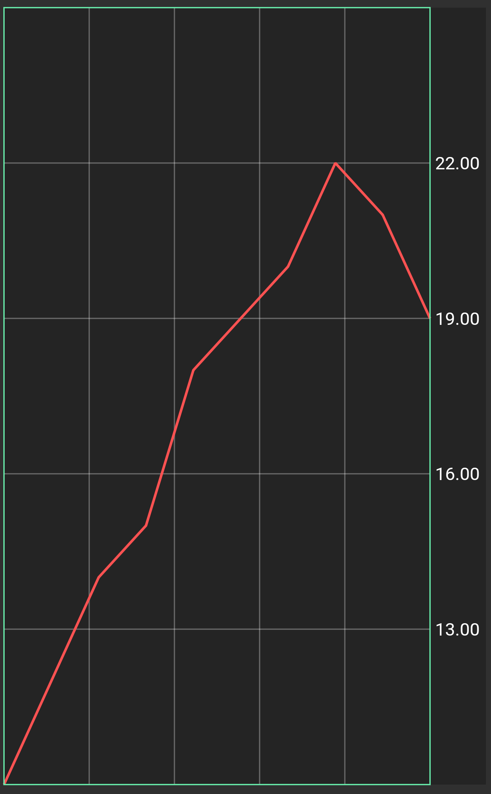
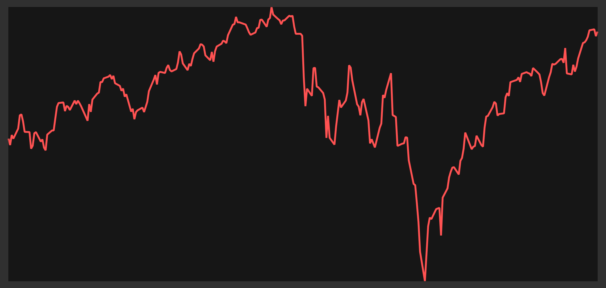

# Flarts - Flutter Charts

#### Flutter + Charts = Flarts

Flarts is a graphing/charting package for Flutter.

<i>S&P 500 in red, Dow Jones Index in green</i>

## Features
   
 - Multiple data sets and plot types on a single Flart
 
 - Auto-fit
   - By default Flarts will size each axis to fit the min and max of the data plotted on that axis.
   
 - Auto-labelling
   - Label values are be interpolated from the type of data on the axis.
   
 - Direction-agnostic axes
   - Your range axes don't have to be vertical and your domain axes don't have to be horizontal. Use what you want.
   
 - Customization
   - Axis Labels
     - The label text can be interpolated from the data on that axis, or it can be the index of the label.
     - Frequency: Label every gridline, every other gridline, none, or provide your own labels.
   - Axes Side/Direction
     - Any axis can be vertical or horizontal.
     - Any vertical axis can be on the left or right.
     - Any horizontal axis can be on the top or bottom.
   - Axes Gridlines
     - The number of gridlines on each axis can be specified.
   - Styling
     - Color can be specified for each data plot.
     - Styling customization is largely in progress. The first goals are:
       - Custom `TextStyle` on labels
       - Custom `PaintStyle` for gridlines, the chart background, and the chart border
   
   - Plot types
     - Line
     - Bar
     - More plot types are currently in development. The first goal is candlesticks (OHLC).

## Examples

### Simple data, simple example

This basic example uses a custom range axis (from 10-25), and doesn't provide a custom domain axis so the chart fits the domain data.

-----

### Spark chart

The Spark Chart is a sleek pre-styled chart with no labels or gridlines.

-----

### Multiple data sets and plot type

This chart plots the price of the S&P 500 and Dow Jones Indices, as well as the volume of the S&P 500 Index, from April 10 2018 to April 10 2019. The S&P price is drawn in red, the Dow Jones price in green, and the S&P volume in blue (the bars).

All three data plots share the same domain axis, which is derived from the dates in the price data.
The labels on the left axis are interpolated from the S&P's volume data.
The labels on the right axis are interpolated from the S&P's price data.

-----

